# 济宝——校园二手交易平台

## 一.界面展示

### 注册


### 登录


### 主页

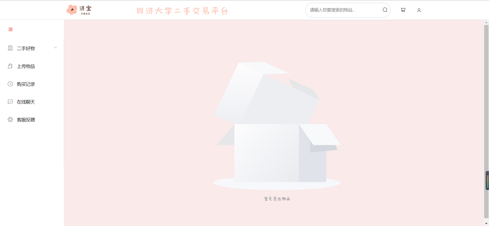

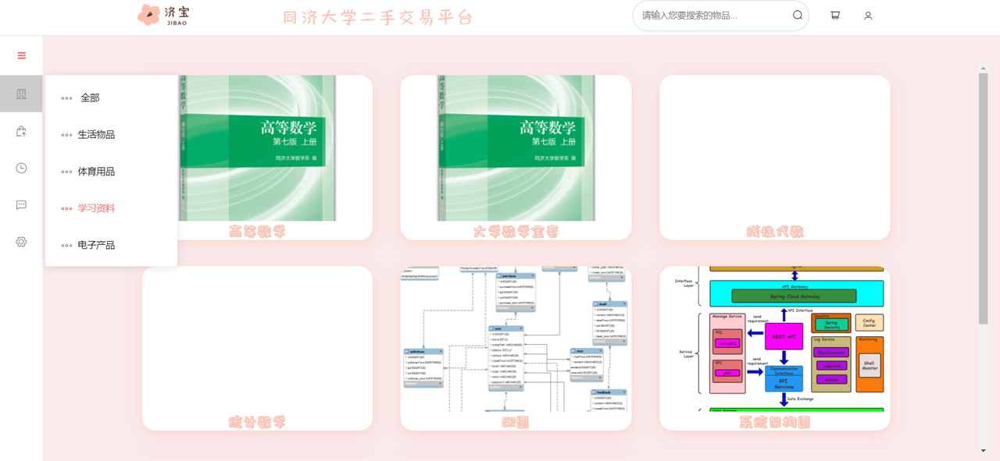
### 个人信息

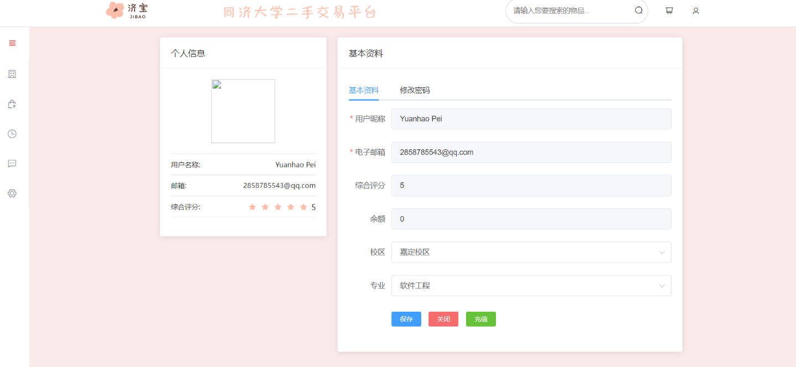

### 上传物品

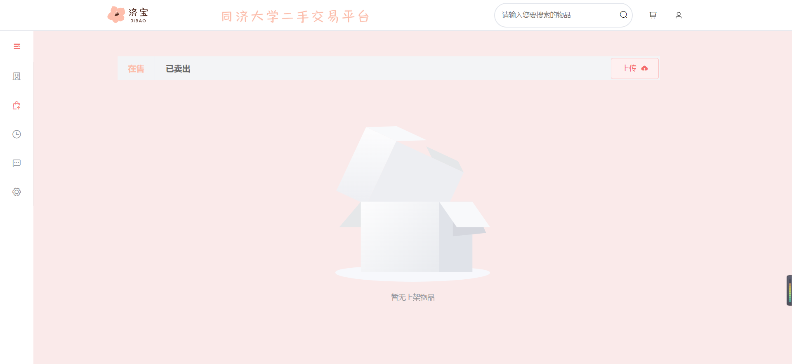

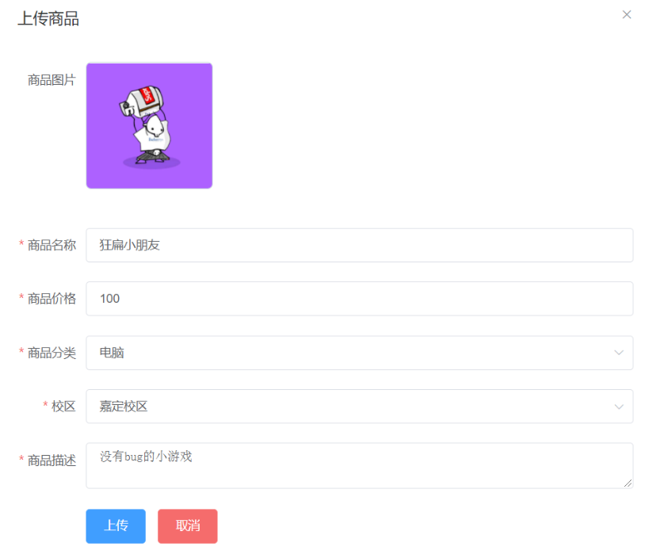


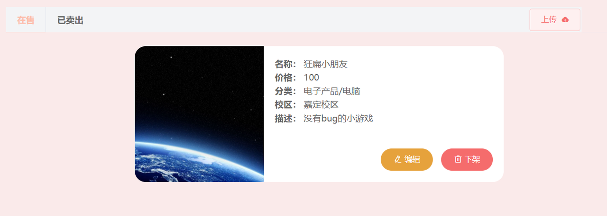

### 购买记录

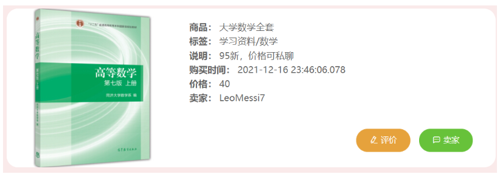

**评价**

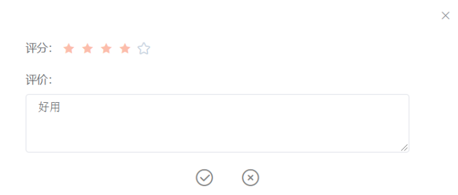

### 联系商家

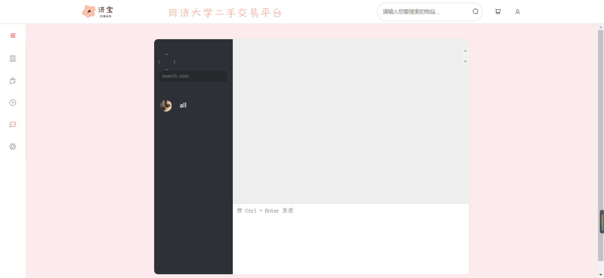

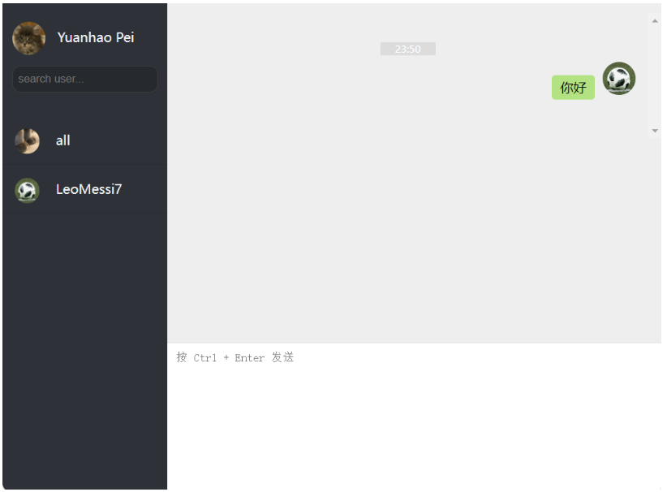

### 购物车

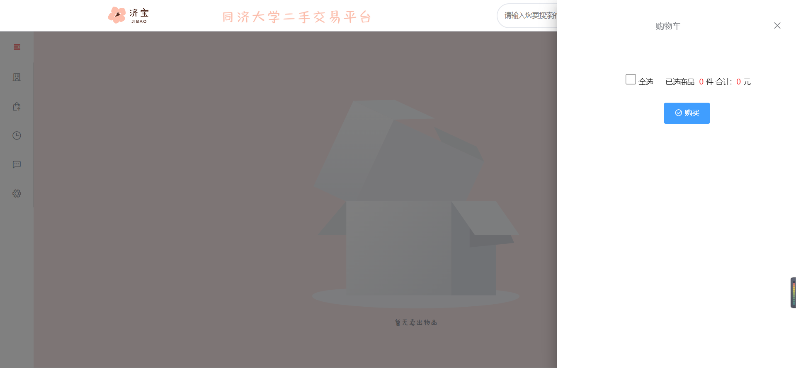

## 二.安装

``` bash
# install dependencies
npm install

# serve with hot reload at localhost:8080
npm run dev

# build for production with minification
npm run build

# build for production and view the bundle analyzer report
npm run build --report

#安装axios
npm run axios
```


